# Determining Heart Disease

Using the [UCI heart disease dataset](https://archive.ics.uci.edu/ml/datasets/heart+Disease), I want to determine if patients have heart disease or not given the features in this dataset, which are detailed below. I used logistic regression to classify and predict, whose hyperparameters are tuned using azure hyperdrive. This was then compared against azure's automl search to identify the most accurate model, which was then operationalized by deploying to ACI with Azure application insights.

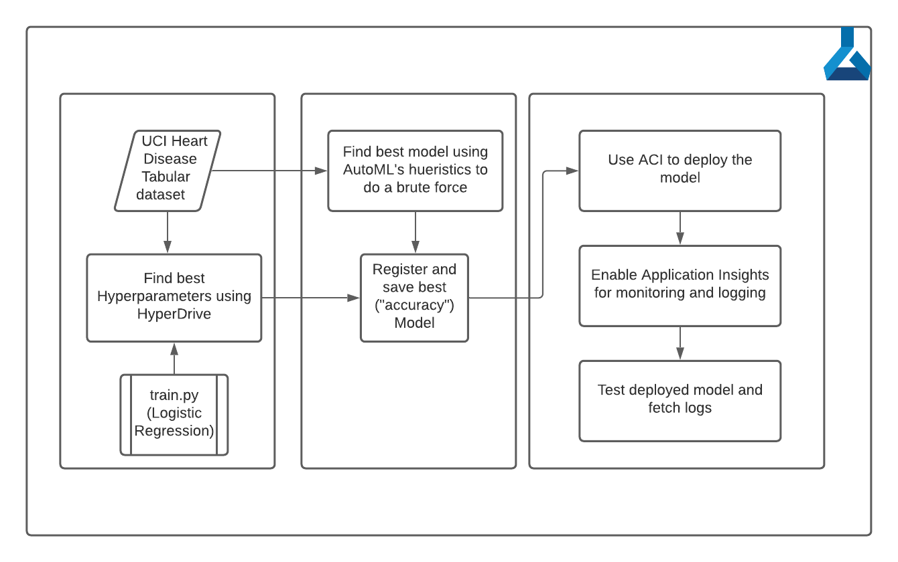


## Project Set Up and Installation
First import the [UCI heart disease dataset](https://archive.ics.uci.edu/ml/datasets/heart+Disease) to Azure datasets and name it `uci_heart_disease`. Run all the cells in both the Jupyter notebooks, starting with hyperdrive, which will leverage the `train.py` script. Then, run the automl notebook that will execute automl runs (note that I have a beefy cluster from work, so the parallel runs can be reduced to be cost efficient) and save the best model. It will then use this model to deploy with ACI and test. 

## Dataset

### Overview
I'm using the [UCI heart disease dataset](https://archive.ics.uci.edu/ml/datasets/heart+Disease). The column names are abbreviated, which is elaborated below:
1. `age`: age, in years
1. `sex`: gender (1 = male, 0 = female)
1. `cp`: chest pain level ( 1: typical angina, 2: atypical angina, 3: non-anginal pain, 4: asymptomatic)
1. `trestbps`: resting blood pressure (mm Hg)
1. `chol`: cholesterol (mg/dl)
1. `fbs`: fasting blood sugar (1 = true; 0 = false)
1. `restecg`: Resting electrocardiographic measure (0 = normal, 1 = abnormality, 2 = probable or definite left ventricular hypertrophy)
1. `thalach`: maximum heart rate
1. `exang`: Exercise induced angina (1 = yes; 0 = no)
1. `oldpeak`: ST depression induced by exercise relative to rest ('ST' relates to positions on the ECG plot)
1. `slope`: the slope of the peak exercise ST segment (Value 1: upsloping, Value 2: flat, Value 3: downsloping)
1. `ca`: The number of major vessels (0-3)
1. `thal`: A blood disorder - thalassemia (3 = normal; 6 = fixed defect; 7 = reversable defect)
1. `target`: Heart disease (0 = no heart disease, 1 = has heart disease) (y-variable)

The dataset details multiple predictors for whether a patient will have heart disease or not (`target`). The goal is to create a model that is most accurate at predicting the `target` given the above detailed risk factors and test results. 

### Task
Use a ml model such as logistic regression (classification) or automl searched models to predict if a patient has a heart disease (`target` column) or not based on the other x-variables detailed above.  

### Access
The [UCI heart disease dataset](https://archive.ics.uci.edu/ml/datasets/heart+Disease) csv file is uploaded to ML Studio datasets section and registered as a [TabularDataseta](https://docs.microsoft.com/en-us/python/api/azureml-core/azureml.data.tabulardataset?view=azure-ml-py) and accessed in the notebook via `azureml.core`'s `Dataset.get_by_name` method. 

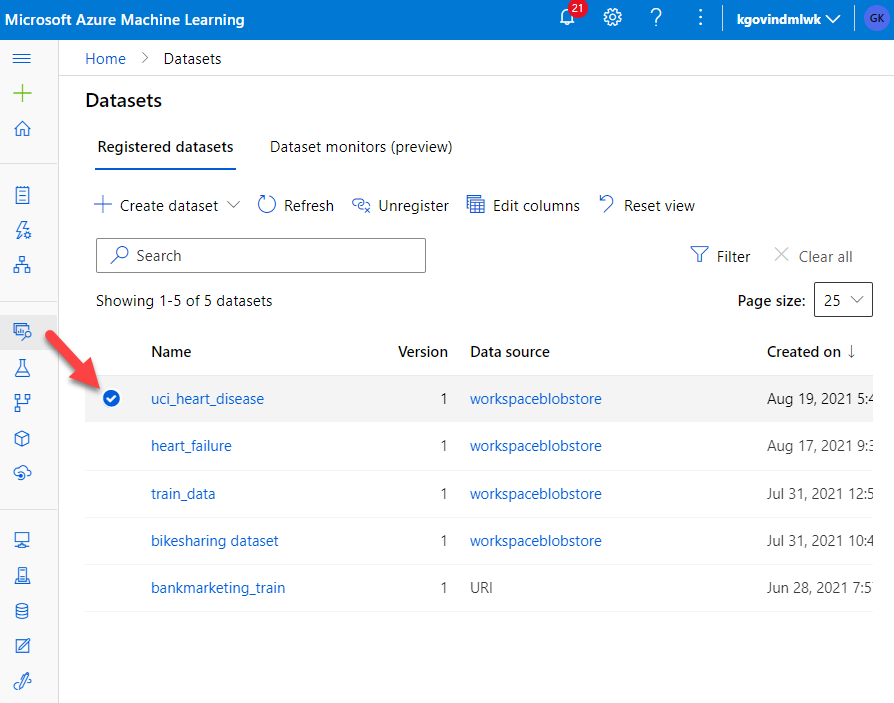


## Automated ML
With a somewhat smaller dataset, the automl runs were relatively quick and the goal was to run a classification search with `30` iterations to identify the most accurate model, which turned out to be a `StandardScaler LogisticRegression` model (`86.12%` accurate and `91.97%` AUC weighted) with the following training hyperparameters:
```json
{
    "class_name": "LogisticRegression",
    "module": "sklearn.linear_model",
    "param_args": [],
    "param_kwargs": {
        "C": 51.79474679231202,
        "class_weight": null,
        "multi_class": "ovr",
        "penalty": "l2",
        "solver": "lbfgs"
    },
    "prepared_kwargs": {},
    "spec_class": "sklearn"
}
```
as shown below:
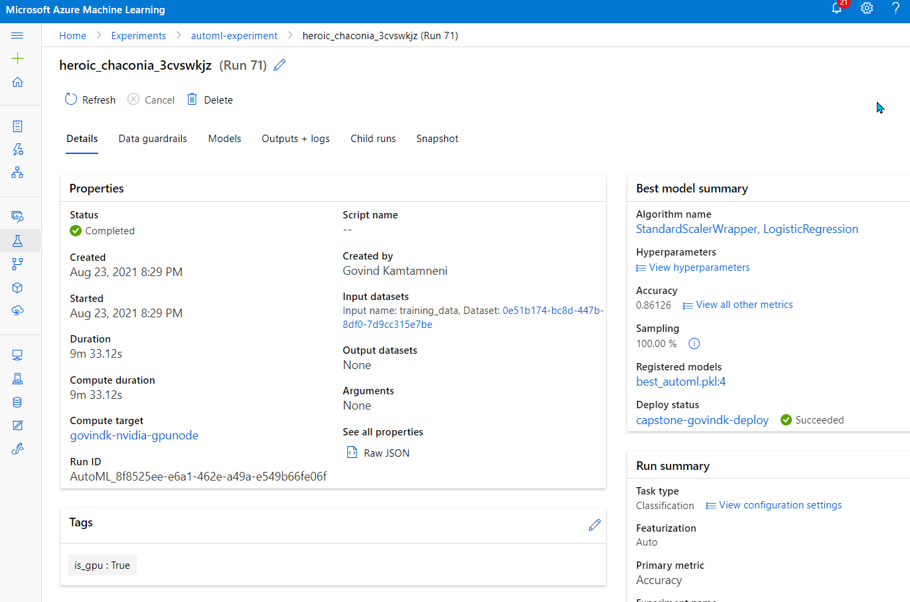

In addition, here's the run details of the automl invocation from within the notebook:
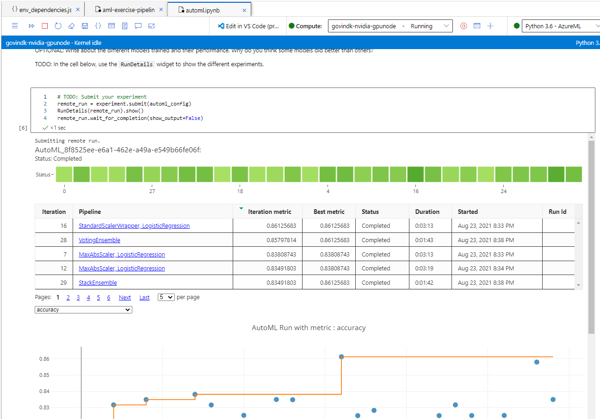

The top regressors turned out to be the number of major vessels (`ca`), chest pain level (`cp`), and thalassemia level (`thal`):
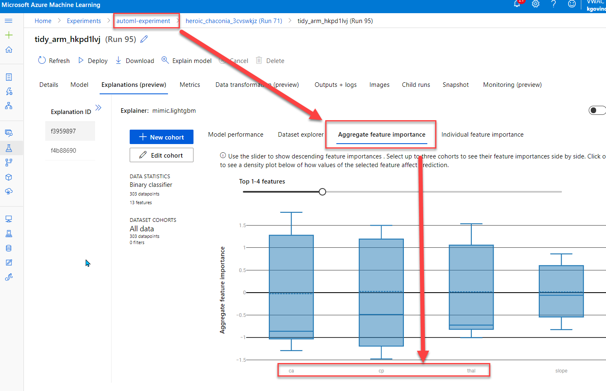

The automl run was configured to optimize on `accuracy` (as set for `primary_metric`), with a 15-min `experiment_timeout_minutes`, and 5% of dataset to be use for validation (as specified in `n_cross_validations` attribute), and `featurization` was set to `auto` so that automl run could automatically customize featurization. Finally, enable early stopping was set to true so that we could optimize cloud resources

The featurization setting could be improved in the future with a `FeaturizationConfig` object with transformer customizations that could've tailored even better automl accuracies. 


## Hyperparameter Tuning
*TODO*: What kind of model did you choose for this experiment and why? Give an overview of the types of parameters and their ranges used for the hyperparameter search
A LogisticRegression model was used in `train.py` script to predict the `target` column using the above regressors. The two hyperparameters that were parameterized and optimized using hyperdrive are: `Regularization Stregth - C` and `Max iterations - max_iter`. 

The `C` hyperparameter regularizes to apply a penalty to increasing the magnitude of paramter values to reduce overfitting. It's a positive float number and smaller values specify stronger regularization. Meanwhile `max_iter` hyperparameter specifies the maximum number of iterations for the solvers to converge. Finally, number of cpu cores and input data is also passed to train.py as parameters from the notebook when invoked. 

There is also an early termination policy, `Bandit`, with a `10%` slack factor, which specified how much slack is allowed with respect to the best performing training run, and a `evaluation_interval` of `2`, which specifies the frequency for applying the policy, and a `delay_evaluation` set to `5`, which delays the first policy evaluation for `5` intervals. This bandit policy ensures that we are optimizing our compute resources while executing a hyperparameter search and not waste on hyperparameters that won't lead to most accurate models. 

The hyperparameters that produced the most accurate logistic regression model were: `--C (Regularization Strength)` of `0.09196`, and `--max_iter (Max iterations)` of `128`, resulting in an `accuracy` of `93.4%`. 
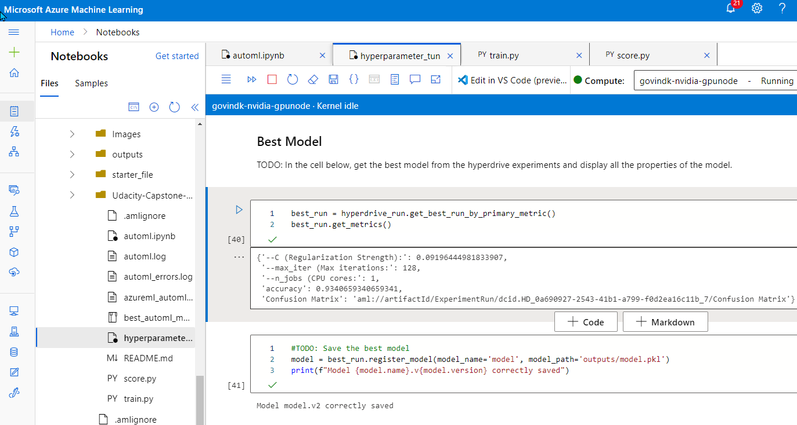
Here's an additional screenshot of all teh child runs that were executed by hyperdrive
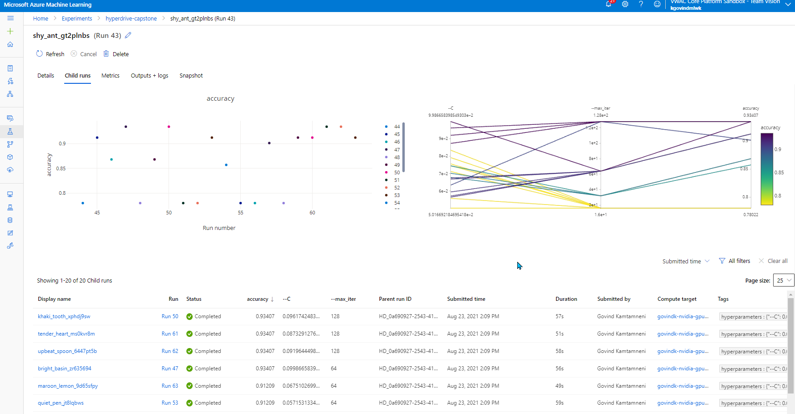
The hyperparameters that lead to the most accurate model's confusion matrix is shown below
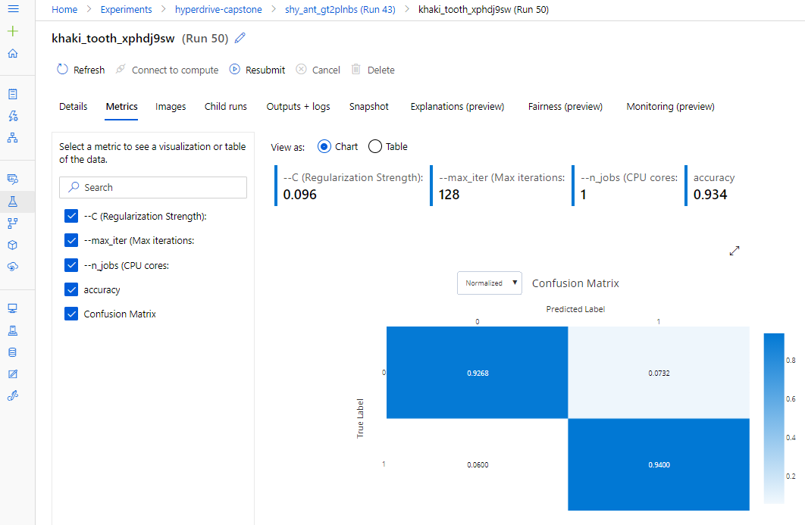

This can be improved if we increase the number of runs (especially in situations like mine where I have a beefy cluster from work) and also try out other metrics for primary metric.

## Model Deployment
The best model from automl is deployed using azureml sdk with applicaiton insights enabled. It was then invoked from within the automl notebook using `service.run` and the first row (converted to json) as input, as shown below:
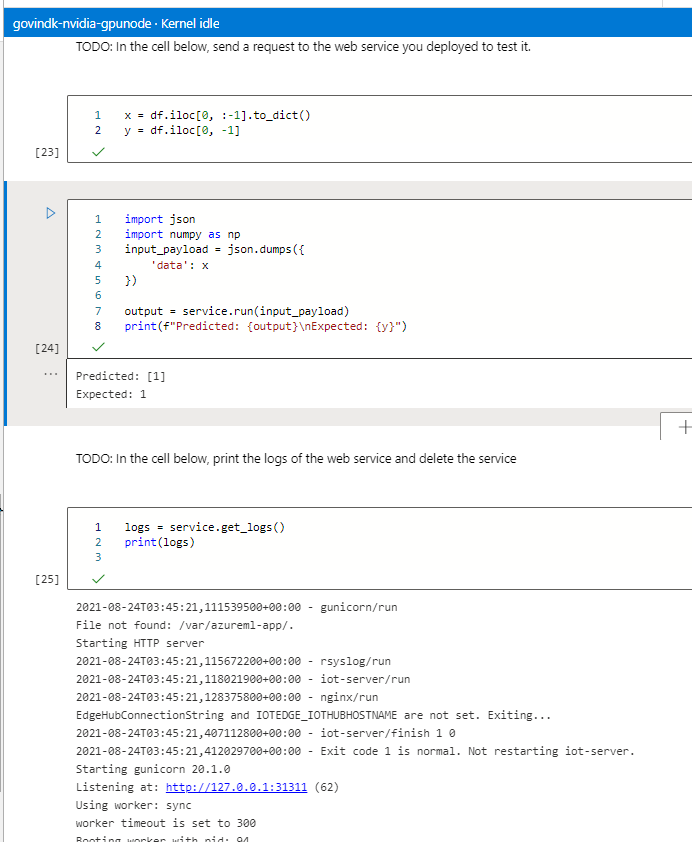

The model endpoint is also accessible from endpoints table and from any REST client:
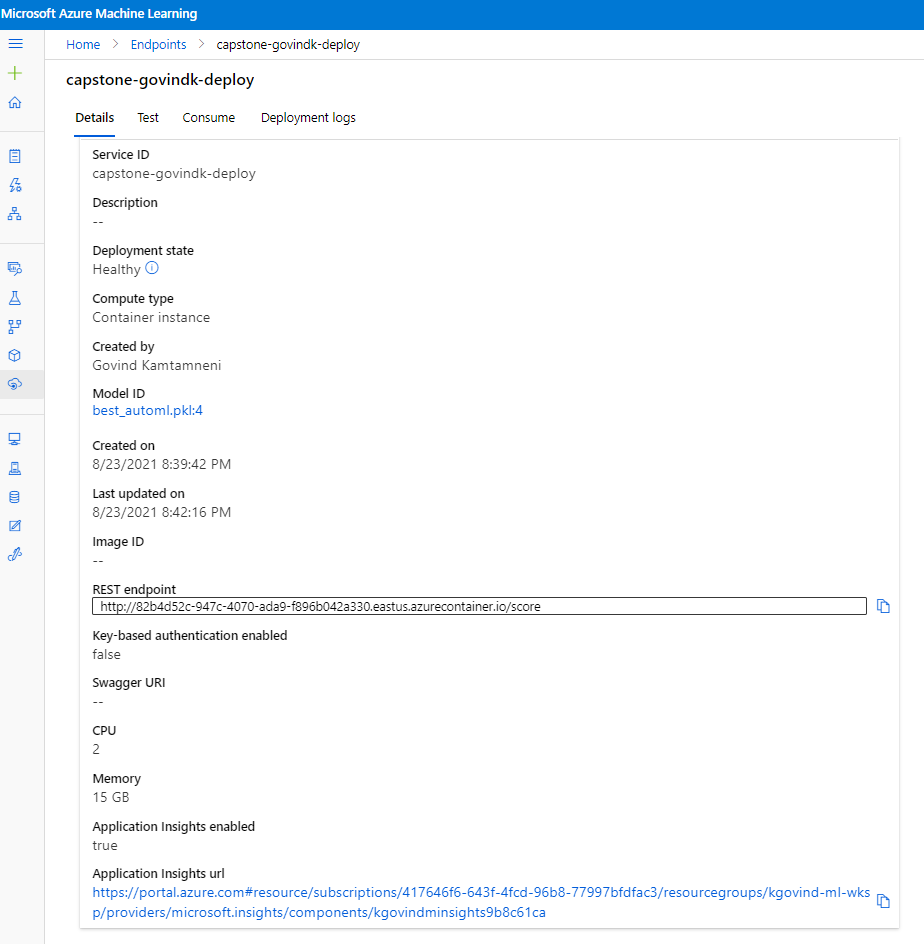

Here's an example invocation from a REST client, resulting in a 200 response with the expected response for `target`:
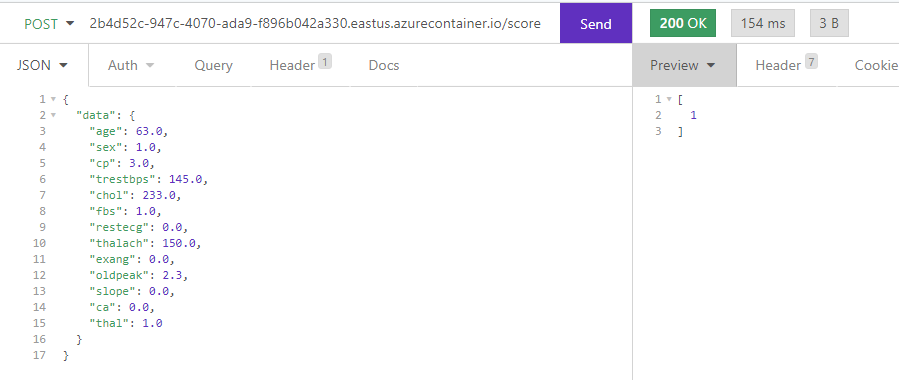


And application insights also logs model invocations and performance:
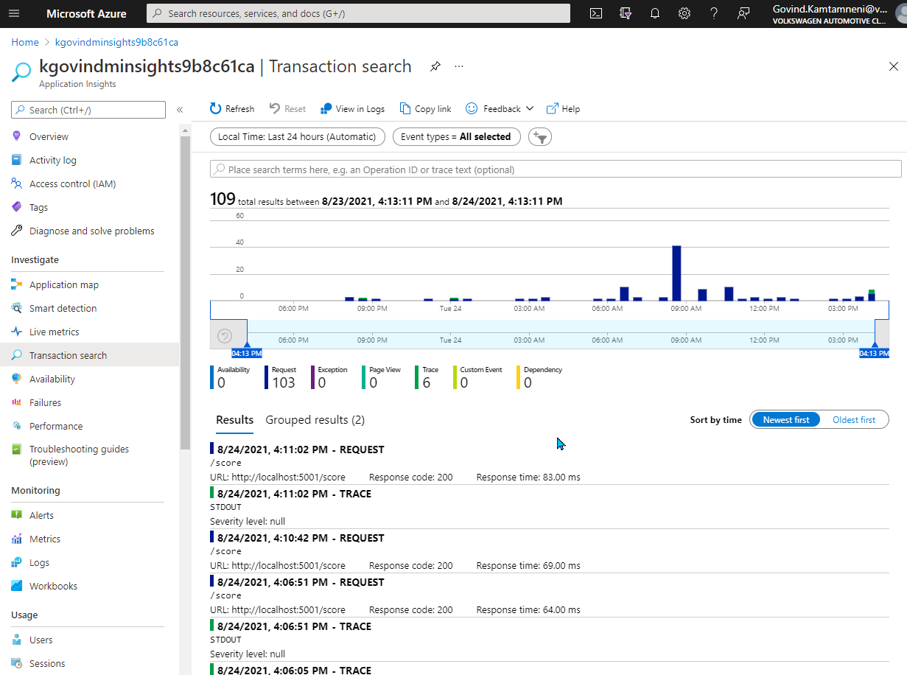

## Screen Recording
- https://www.screencast.com/t/AmBXh4G3qq